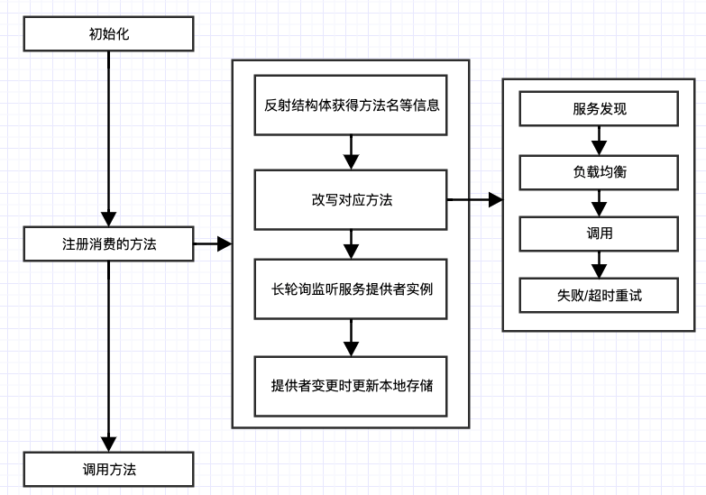

# Consumer

## 使用方法

读取配置文件并完成初始化后，注册服务端提供包中对应的服务结构体实例，即可采用该实例进行rpc调用。

```go
config.Load()
var p = HelloServiceConsumer{}
err := consumer.RegistryConsumer(PROVIDER_NAME, &p)
// 调用
res, rpcErr := p.Hello(HelloRequest{Target: "World"})
```

## 内部实现



### 1.初始化

读取配置信息。

### 2.注册消费的方法

通过反射对结构体中每个`func`成员进行赋值，实现rpc call。

首先对传入的结构体进行校验：

* 字段类型为`reflect.Func`
* 必须有1个入参，且入参类型为`reflect.Struct`
* 必须有2个返回值，且第一个返回值类型为`reflect.Struct`

#### 改写rpc方法信息

每个方法对应的信息包括：

* 提供者服务名
* 方法名
* 核心信息，如：负载均衡类型、超时重试次数、超时时间

根据配置粒度大小的规则，获得每个方法的核心信息。

##### 服务发现

morax consumer启动单独的goroutine对consul注册中心进行长轮询，将获取到的消费端订阅的服务实例信息同步到消费端的存储中。

详见“长轮询监听服务提供者”一节。

##### 负载均衡

通过配置文件指定的负载均衡算法，选出对应的`net/rpc` client实例。

##### 调用

同步调用通过`client.Call()`方法实现

当超时发生，或调用失败，应及时终止调用逻辑，因此，执行rpc call的函数采用context实现取消：

```go
invoke := func(ctx context.Context, timer *time.Timer, isRetry bool) {
  if isRetry {
    timer.Reset(time.Millisecond * time.Duration(info.Timeout))
  }

  for {
    select {
      case <-ctx.Done():
      return
      default:
      core(ctx)
      return
    }
  }
}
```

##### 失败/超时重试

上述`invoke`函数将在单独的goroutine中执行，通过三个channel传递调用结果：

* callSuccessCh：rpc call成功后，将结果写入此channel中
* callFailCh：rpc call返回error，将error信息写入此channel中
* timer.C：超时channel

通过select语句监听每个通道，当失败或超时发生，根据设定的重试次数进行重试。

*TODO：实现重试时重新选择服务实例*

#### 长轮询监听服务提供者实例

consul不具有推送服务状态变更的功能，需要通过长轮询机制去监听服务提供者实例的变更。

morax中，该过程将在一个goroutine中实现。

