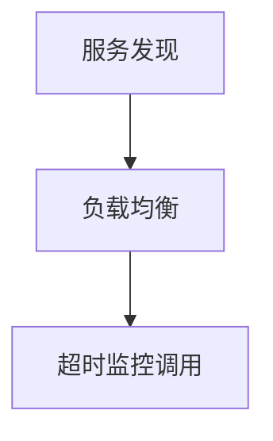

# Consumer

## 使用方法

读取配置文件并完成初始化后，注册服务端提供包中对应的服务结构体实例，即可采用该实例进行rpc调用。

```go
config.Load()
var p = HelloServiceConsumer{}
err := consumer.RegistryConsumer(PROVIDER_NAME, &p)
// 调用
res, rpcErr := p.Hello(HelloRequest{Target: "World"})
```

## 内部实现

注册Consumer时，内部通过反射对结构体中每个`func`成员进行赋值，实现rpc call。

#### 1.校验结构体字段

传入结构体实例的指针后，通过反射获取此结构体的成员信息并进行校验，校验规则：

* 字段类型为`reflect.Func`
* 必须有1个入参，且入参类型为`reflect.Struct`
* 必须有2个返回值，且第一个返回值类型为`reflect.Struct`

#### 2.组装rpc方法信息

每个方法对应的信息包括：

* 提供者服务名
* 方法名
* 核心信息，如：负载均衡类型、超时重试次数、超时时间

根据配置粒度大小的规则，获得每个方法的核心信息。

#### 3.实现rpc call过程

通过`reflect.MakeFunc`生成进行rpc call的实现函数并赋值到对应的结构体字段中。

rpc call过程包括：



##### 超时重试

采用go的`time.Timer`进行定时。

实现rpc call的方法通过三个channel传递调用结果：

* callSuccessCh：rpc call成功后，将结果写入此channel中
* callFailCh：rpc call返回error，将error信息写入此channel中
* timer.C：超时channel

当发生超时时，应及时终止调用逻辑，因此，执行rpc call的函数采用context实现取消：

```go
invoke := func(ctx context.Context, timer *time.Timer, isRetry bool) {
  if isRetry {
    timer.Reset(time.Millisecond * time.Duration(info.Timeout))
  }

  for {
    select {
      case <-ctx.Done():
      return
      default:
      core(ctx)
      return
    }
  }
}
```

