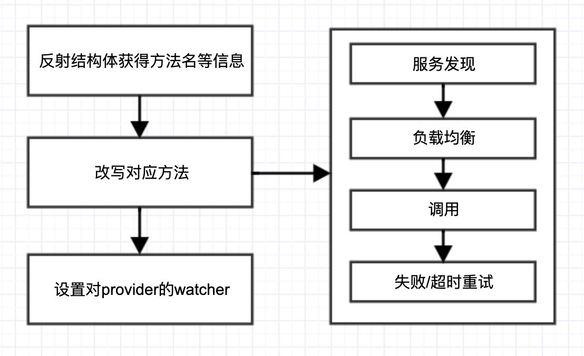

# Consumer

## 使用方法

读取配置文件并完成初始化后，注册服务端提供包中对应的服务结构体实例，即可采用该实例进行rpc调用。

```go
config.Load()
var p = HelloServiceConsumer{}
err := consumer.RegistryConsumer(PROVIDER_NAME, &p)
// 调用
res, rpcErr := p.Hello(HelloRequest{Target: "World"})
```

## 内部实现

### 1.初始化

* 存储配置信息
* 初始化底层存储结构
* 关闭标志位初始化为`false`

### 2.注册消费的方法

流程如下：



通过反射对结构体中每个`func`成员进行赋值，实现rpc call。

首先对传入的结构体进行校验：

* 字段类型为`reflect.Func`
* 必须有1个入参，且入参类型为`reflect.Struct`
* 必须有2个返回值，且第一个返回值类型为`reflect.Struct`

#### 改写rpc方法信息

每个方法对应的信息包括：

* 提供者服务名
* 方法名
* 核心信息，如：负载均衡类型、超时重试次数、超时时间

根据配置粒度大小的规则，获得每个方法的核心信息。

##### 核心逻辑

核心逻辑被封装在一个匿名函数中。rpc call成功时，返回一个`<-chan []reflect.Value`，失败时则返回`nil`通道，同时向`callFailCh`写入错误信息。具体调用过程如下：

**(1) 服务发现**

morax consumer启动单独的goroutine对consul注册中心进行长轮询，将获取到的消费端订阅的服务实例信息同步到消费端的存储中。

详见**“长轮询监听服务提供者”**。

**(2) 负载均衡**

通过配置文件指定的负载均衡算法，选出对应的`net/rpc` client实例。

**(3) 调用**

同步调用通过`client.Call()`方法实现

##### 失败/超时重试

当超时发生，或调用失败，应及时终止调用逻辑，因此，执行rpc call的函数采用context实现取消：

```go
invoke := func(ctx context.Context, timer *time.Timer, isRetry bool) {
  if isRetry {
    timer.Reset(time.Millisecond * time.Duration(info.Timeout))
  }

  select {
    case res := <-core(ctx):
    callSuccessCh <- res
    return
    case <-ctx.Done():
    return
  }

}
```

上述`invoke`函数将在单独的goroutine中执行，通过三个channel传递调用结果：

* callSuccessCh：rpc call成功后，将结果写入此channel中
* callFailCh：rpc call返回error，将error信息写入此channel中
* timer.C：超时channel

通过select语句监听每个通道，当失败或超时发生，根据设定的重试次数进行重试。

> *TODO：实现重试时重新选择服务实例*

#### 设置对provider的watcher

在consumer本地设置订阅的每一个provider服务集群的实例信息存储，并设置`contextWithCancel()`，便于优雅关机时取消watcher goroutine。

### 3.consumer启动watcher

#### 长轮询监听服务提供者实例

consul不具有推送服务状态变更的功能，需要通过长轮询机制去监听服务提供者实例的变更。

morax中，该过程将在一个goroutine中实现，并通过传递`context.Context`实现取消：

```go
func (ps *ProviderInstances) StartWatcher() {
	for {
		select {
		case <-ps.Ctx.Done():
			return
		case <-ps.watch():
			continue
		}
	}
}
```

`pss.Watch()`中，通过HTTP长轮询的方式监控服务提供者实例的状态

```go
// 阻塞
services, meta, err := consul.FindServers(ps.Ctx, ps.providerName, ps.idx)
```

`consul.FinderServers()`函数中，通过如下方式：

```go
func FindServers(ctx context.Context, name string, idx uint64) ([]*consulapi.ServiceEntry, *consulapi.QueryMeta, error) {
	qo := &consulapi.QueryOptions{WaitIndex: idx}
	qo = qo.WithContext(ctx)
	// 阻塞
	return clientInfo.consulClient.Health().Service(name, "", true, qo)
}
```

传入`context`，实现取消功能，即底层的`http.Request.WithContext()`

#### 提供者变更时更新本地存储

提供者实例发生变化时，`clientInfo.consulClient.Health().Service(name, "", true, qo)`即返回，如果存在错误，或者无实例，则消费者存储置为`nil`

当成功返回实例信息时，将之前的信息与当前信息进行比较：

* 之前不存在而现在存在的实例进行新增
* 之前存在现在不存在的要剔除
* 之前存在现在也存在的实例不变

其中，“新增”是指创建新的`rpc.Client`，删除是指，关闭已有的`rpc.Client`，同时从本地存储中移除。

同时，存储返回的`index`，便于下一次请求使用。

除存储实例信息，也需要更新实例Id的列表，便于进行负载均衡。

### 4.优雅关机

消费者服务下线时，需要进行优雅关机，释放对应资源，包括：

* rpc client包含的goroutine和http connections
* 监控服务端实例信息的watcher goroutine本身和其中consul client包含的http client
* consul client底层的http client的idle connections

#### 优雅关机过程

* 关闭标志位设置为`true`
* 关闭所有`rpc.Client`
* 关闭所有consul watcher

