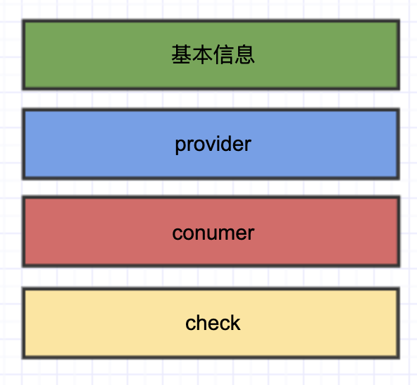
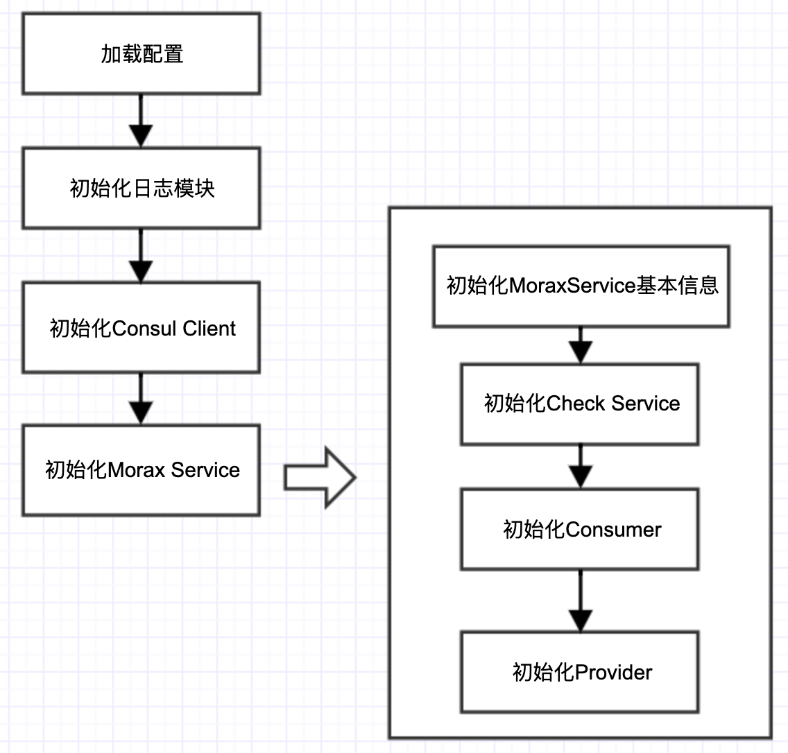
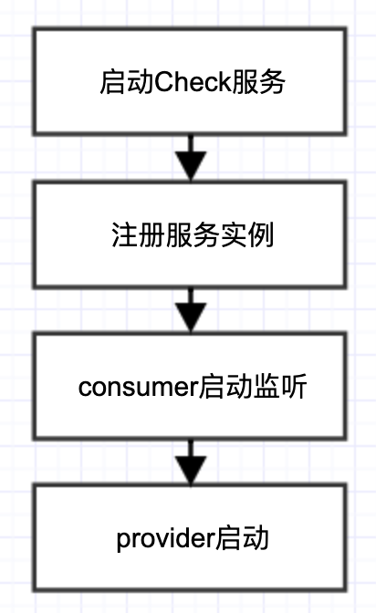
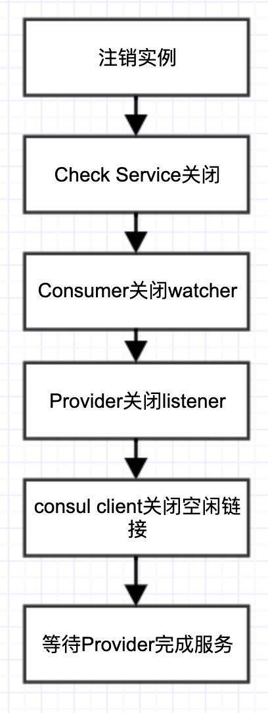

# Morax Service

## 背景

* 每个服务存在多种角色：提供者、消费者、同时作为提供者或消费者
* 每种角色需要的资源各种各样，分开管理不便

基于上述原因，将提供者（provider）、消费者（consum）、健康检查服务（check）进行集成，统一管理，形成Morax Service。

## 组成



### 基本信息

* 服务名
  * 在consul注册中心上注册的服务名
* 服务ip
  * 配置文件中未指定ip时从主机中选择可用ip
* 服务实例id
  * 格式为`name-host:rpcPort`
* rpc服务端口
* context

### provider

详见[provider](./provider.md)

### consumer

详见[consumer](./consumer.md)

### check

详见[check](./Check.md)

## 初始化

Morax Service的初始化流程如下：



程序从配置文件中读取各部分的配置，对Morax Service进行初始化。

配置文件格式参考[配置文件](./配置文件.md)

Morax Service的[provider](./provider.md)、[consumer](./consumer.md)、[check](./check.md)部分的初始化过程详见各部分文档。

需要注意的是，provider和consumer部分根据需要进行初始化，配置文件中无相关部分的配置，则不会进行初始化。

#### 寻找合适的主机ip

使用如下函数寻找合适主机ip。

```go
func GetLocalAddr() (string, error) {
	netInterfaces, err := net.Interfaces()
	if err != nil {
		return "", err
	}

	for _, netIf := range netInterfaces {
		if (netIf.Flags & net.FlagUp) != 0 {
			addrs, _ := netIf.Addrs()
			for _, address := range addrs {
				ipnet, ok := address.(*net.IPNet)
				if ok && !ipnet.IP.IsLoopback() && ipnet.IP.To4() != nil {
					return ipnet.IP.String(), nil
				}
			}
		}
	}

	return "", errors.New("no usable local addr")
}
```

## 注册与订阅方法

通过provider注册本服务要提供的方法，通过consumer注册本服务需要订阅的方法。

## 启动

启动流程如下：



[provider](./provider.md)、[consumer](./consumer.md)、[check](./Check.md)部分的启动过程详见各部分文档。

除向注册中心注册服务实例外，各部分的启动均在单独的goroutine中进行。

## 优雅关机

优雅关机流程如下：



[provider](./provider.md)、[consumer](./consumer.md)、[check](./check.md)部分的启动过程详见各部分文档。