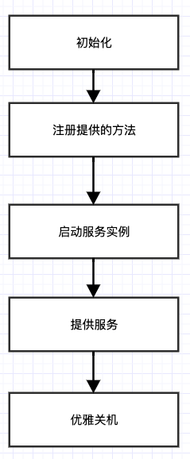
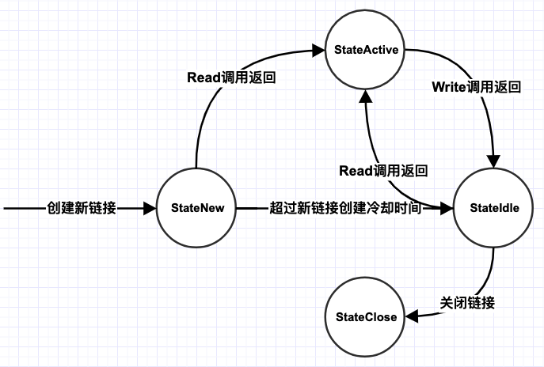

# Provider

## 使用方法

### 1.实现提供的服务

与使用go的`net/rpc`一致，需要创建提供rpc服务的结构体，实现对应的方法：

```go
type HelloService struct {
}

func (service *HelloService) Hello(req HelloRequest, resp *HelloResponse) error {
	*resp = HelloResponse{
		Result: "Hello " + req.Target,
	}
	return nil
}

func (service *HelloService) Bye(req HelloRequest, resp *HelloResponse) error {
	*resp = HelloResponse{
		Result: "Bye " + req.Target,
	}
	return nil
}
```

> 使用morax时需注意：提供服务的方法，入参与返回值尽可能定义为结构体

### 2.向消费者提供包

```go
const PROVIDER_NAME = "sample-hello-service"

type HelloRequest struct {
	Target string `json:"target"`
}

type HelloResponse struct {
	Result string `json:"result"`
}

type HelloServiceConsumer struct {
	Hello func(res HelloRequest) (HelloResponse, error.RpcError)
	Bye   func(res HelloRequest) (HelloResponse, error.RpcError)
}
```

包括：

* 服务提供者服务名
* 方法的入参和返回值的结构体
* 消费者消费服务时调用的结构体

### 3.注册提供的服务

```go
func main() {
	config.Load()

	err := provider.RegisterProvider(PROVIDER_NAME, new(HelloService))
	if err != nil {
		log.Fatal(err)
	}

	provider.ListenAndServe()
	gracefulShutdown()
}
```

morax要求provider的服务名唯一，在底层调用`net/rpc`包的`RegisterName()`方法时，统一传入提供给消费者的`PROVIDER_NAME`	

随后，启动provider服务即可。

## 服务端内部实现介绍




### 1.初始化

初始化过程：

* 读入配置文件中`provider`部分
* 寻找合适的主机ip
* 初始化Service

#### 寻找合适的主机ip

使用如下函数寻找合适主机ip。

```go
func GetLocalAddr() (string, error) {
	netInterfaces, err := net.Interfaces()
	if err != nil {
		return "", err
	}

	for _, netIf := range netInterfaces {
		if (netIf.Flags & net.FlagUp) != 0 {
			addrs, _ := netIf.Addrs()
			for _, address := range addrs {
				ipnet, ok := address.(*net.IPNet)
				if ok && !ipnet.IP.IsLoopback() && ipnet.IP.To4() != nil {
					return ipnet.IP.String(), nil
				}
			}
		}
	}

	return "", errors.New("no usable local addr")
}
```

#### 初始化Service

根据读入的配置文件进行初始化，包括如下内容：

* 存储实例id、提供rpc服务的address、健康检查address
* 将服务关闭标志位置false

### 2.注册实例到consul

服务名为对外提供的包中声明的服务名，消费者通过此服务名寻找对应服务。

服务的实例ID格式为：

```go
{serviceName}-{Host}:{Port}
```

健康检查采用`TCP`的方式进行。

### 3.注册提供的方法

与`net/rpc`包的使用方式一致。

> 注意：服务的name统一为provider name，而不是具体的结构体的名字

### 4.启动服务

创建两个goroutine，用于提供rpc服务和健康检查服务。

注意：由于每个服务仅在对应的goroutine中阻塞，main goroutine需要阻塞直到需要运行结束，推荐实现优雅关机逻辑。

>由于`net/rpc`包通过启动一个goroutine去调用对应的方法，因此如果实现的方法中存在panic，则会导致服务整体宕机，最好在每个方法中实现recover

每个goroutine中，绑定对应的address，同时，服务跟踪每个listener，当goroutine结束退出时，将对应的listener移除跟踪。

### 5.提供服务/健康检查

对于健康检查服务，直接返回即可。

#### rpc服务

对于每个新的消费者的链接，服务端启动一个新的goroutine进行服务。

`net/rpc`包中，默认客户端和服务端之间通过单一长链接进行通信，因此，morax的消费者和提供者之间也默认采用单一长链接。

### 6.优雅关机

rpc 服务端优雅关机原理

> - 停止时，先标记为不接收新请求，新请求过来时直接报错，让客户端重试其它机器。
> - 检测正在运行的线程，等待线程执行完毕

服务端优雅关机涉及到的资源：

* 每个客户端链接
* 服务端listener
* Consul client种的Idle connection
  * 默认consul client采用长链接的方式与server通信
  * 不关闭Idle connection会导致shutdown后goroutine泄漏

#### 优雅关机过程


主要参考`net/http`包中的`Shutdown()`方法。

#### provider端实现

`net/rpc`包中，默认客户端主动关闭链接，服务端没有对应的API主动关闭链接。morax通过自定义的编解码器(`rpc.ServerCodec`)和链接(`net.Conn`)实现链接的主动关闭。

##### 自定义链接

参考并使用`net/http`包中的链接状态(`ConnState`)，对一个`net.Conn`接口的实例进行包装：

```go
type rpcConn struct {
	curState struct{ atomic uint64 }
	rwc      net.Conn
}
```

**状态转换**



设置与获取状态的方法参考`net/http`包的实现：

```go
func (rc *rpcConn) setState(state http.ConnState) {
	if state > 0xff || state < 0 {
		panic("internal error")
	}
	packedState := uint64(time.Now().Unix()<<8) | uint64(state)
	atomic.StoreUint64(&rc.curState.atomic, packedState)
}

func (rc *rpcConn) getState() (state http.ConnState, unixSec int64) {
	packedState := atomic.LoadUint64(&rc.curState.atomic)
	return http.ConnState(packedState & 0xff), int64(packedState >> 8)
}
```

##### 自定义编解码器

编解码器对应通信协议，目前morax基于json协议进行通信。参考`net/rpc/jsonrpc`包中的`serverCodec`实现，自定义服务端编解码器：

```go
type JsonServerCodec struct {
	dec  *json.Decoder // for reading JSON values
	enc  *json.Encoder // for writing JSON values
	conn io.Closer

	req serverRequest

	mutex   sync.Mutex // protects seq, pending
	seq     uint64
	pending map[uint64]*json.RawMessage
  // 新增
	isClose types.AtomicBool
	server  *Service
}
```

其中，`isClose`维护编解码器的关闭状态，`server`指针用于使用当前编解码器的rpc server跟踪当前编解码器。

* 调用`ReadRequestHeader()`时，如果编解码器处于关闭状态，则返回`io.EOF`
* 调用`ReadRequestBody()`时，如果编解码器处于关闭状态，则返回`io.EOF`
* 调用`Close()`时，如果编解码器已经处于关闭状态，则返回，避免重复关闭

**关闭空闲链接**

主要步骤如下：

* 判断编解码器是否处于关闭状态，避免重复关闭
* 获取当前编解码器绑定的链接的状态
* 判断是否为空闲态，或处于新建态超过了一定时间
  * 参考`net/http`包
* 关闭处于空闲态的链接
  * 关闭编解码器（`Close()`方法）的实质即为关闭编解码器绑定的链接
* 将编解码器置为关闭态
* 从server中移除编解码器